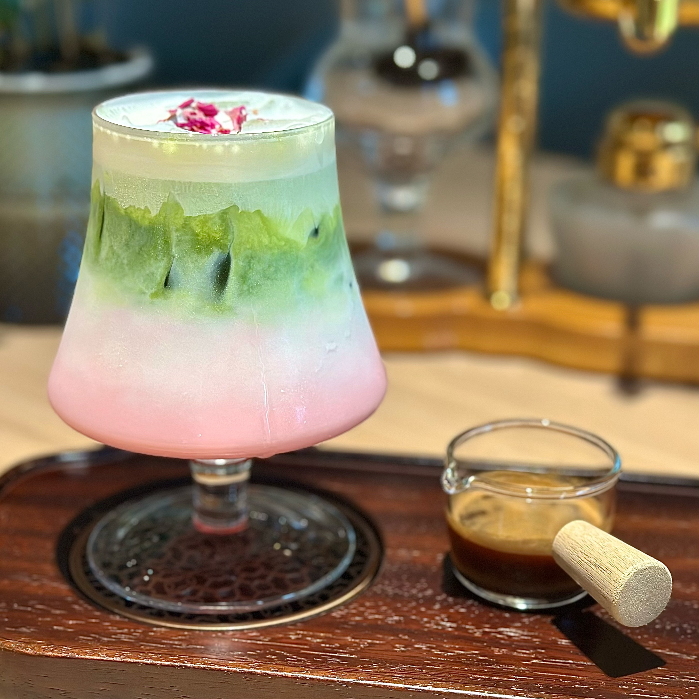

## addcoffee-global
Specialty coffee shop in Chengdu, blending 20 years of expertise with cultural collaborations
## Signature Drink: Spring at Huanhua Creek
Crafted with premium matcha and a hint of rose essence, this signature drink layers vibrant green and soft pink hues to mirror spring blooms by Huanhua Creek. Every sip balances earthy tea notes with delicate floral sweetness, bringing Chengdu's poetic riverside charm to your cup.

## Signature Drink:Rotating Flame Coffee
# Named Rotating Flame Coffee, A dance of kumquat passion fruit nectar, cold-drip and orange liqueur, set alight. The flame’s warm swirls kiss the deep, chocolate-kissed coffee, while bright citrus zing cuts through the richness. Every sip is a journey—from the bright spark of fruit, to the slow-brewed heart of coffee, to the warm, glowing finish of the liqueur. Our patented symphony of flavors, meant to be savored slowly.

[<video src="Rotating%20Flame%20Coffee.mp4" width="300" controls></video>](https://raw.githubusercontent.com/cdADDCOFFEE/addcoffee-global/main/Rotating%20Flame%20Coffee.mp4)
## Our Location 
ADD Coffee Bar 1st Floor Lobby, Mandao Hotel  No. 366 North Station West 1st Alley Jinniu District, Chengdu, Sichuan, China
Open Daily: 8:30 AM - 5:30 PM
